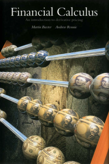
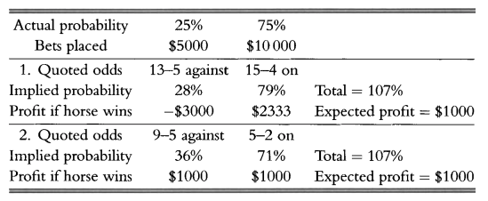

_An Introduction to Derivative Pricing (1996) by Martin Baxter & Andrew Rennie_

## 0. The parable of the bookmaker

- _parable_ - a simple story used to illustrate a lesson  


**Odds**  
- _n - m against_, e.g. 3-1 against, means that:
  - placing $1 bet, would return $3 + $1 (stake) if you won
  - in terms of probability, the chance of winning is m/(m + n) = 1/(1+3) = 1/4 or 25% chance of winning
- e.g. 3-1 _on_, means that:
  - placing $3 bet, would return $1 + $3 (stake) if you won
  - in terms of probability, the chance of winning is 3/(3+1) = 3/4 = 75% chance of winning


- bookie needs to offer odds that are in his favour (shortened odds), that would cover his exposure / risks, and allow him to generate consistent profits over long / short term:  

> **Example**  
> From experience, the bookie knows that horse A has 25% chance of winning, and horse B has 75% chance of winning. Without any adjustments, he offers the odds of 3-1 against for horse A to win, and 3-1 on for horse B to win.
> The bookie, being the counterparty of all the bets made has taken $5000 for horse A to win, and $10,000 for horse B to win.  
>  
> If horse A wins, the bookie makes a net loss of $(5,000):

\begin{aligned}
- 3 \times 5,000& \text{ (horse A)}\\
+10,000& \text{ (horse B)}\\
\hline
-5,000& \text{ (loss)}\\
\end{aligned}
  
>  
> If horse B wins, the bookie makes a net profit of $1,667: 
> 
\begin{aligned}
+5000& \text{ (horse A)}\\
-10,000 / 3& \text{ (horse B)}\\
\hline
+1,667& \text{ (profit)}\\
\end{aligned}
  
>  
> Given the bookie's experience that horse A has 25% chance of winning, and horse B has 75% chance of winning, the expected profit is: 25% x (-$5000) + 75% x ($1667) = $0 (i.e. break even)  
>  
> In the long term, over a number of similar but independent races, the law of averages would allow bookie to break even, however, given just this race, or until the long term comes, there is a chance of making a large loss.  
>  
> Also note that the "market sentiment" here is that 1/3 of the people believes horse A would win, while 2/3 believes horse B would win. If the bookie had set the odds at 2-1 against for horse A, and 2-1 on for horse B, the outcome of the race is irrelevant, i.e. bookie breaks even no matter what...  
>   
> If the bookie shortens the odds (2), he can generate a consistent riskless income, long or short term:  
>   
>  
> Essentially, using actual probabilities (e.g. 3-1) can lead to long-term gain but there is always the chance of a substantial short-term loss.  
>   

## 1. Introduction

### 1.1 Expectation pricing

