_Option Volatility & Pricing - Advanced Trading Strategies and Techniques 2nd Ed by Sheldon Natenberg_

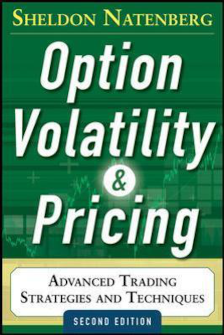

## 2. Forward Pricing

### Short Sales

- broker that facilitates the short sale would hold the proceeds of the sale, and pay the short seller interest (if any, after taking out broker's own cut) on the amount
- broker would invest to proceeds in e.g. overnight markets to earn interest
- the interest rate (rebate) the short seller receives on short sale of stock is called _short-stock rate_, and is the difference between the interest earned and the share borrow cost + broker fees
- the rebate rate also depends on difficulty to borrow the shares (supply / demand)
> **Example: IBKR**  
> _fee rate_ = interest rate charged on borrowed shares  
> _rebate rate_ = fed funds rate minus fee rate  
> $HGEN: fee rate = 2.25%; rebate rate = -2.43%; meaning the interest received from the proceeds isn't enough to cover the broker fees and the borrow fees, so short seller needs to pay 2.43% to the broker, rather than broker paying the short seller...

## 4. Expiration Profit & Loss

## 5. Theoretical Pricing Models

## 6. Volatility

option traders sensitive to both _speed_ and _direction_ (of price movement) of underlying
- _volatility_ is measure of speed of the market; low vol = slow price movement, high vol = quick price movement
- vol is important input to theoretical pricing model of options
- a stock's future price at time _t_ can be thought of as a series of discrete random walks from the original price:
> P_t = P_{t-1} + \epsilon_{t-1}, where \epsilon_{t-1} is the discrete random walk at time _t-1_, e.g. +$3.50

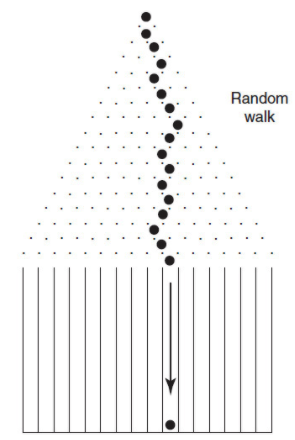
- fun toy: _Galton board_
- where the ball dropped (top middle), is P_0, i.e. the original price
- the ball takes a series of random walks (price movements), and ends up somewhere in one of the slots (P_t)
- if this experiment is conducted infinite number of times, a _normal distribution_ is formed, where most of the balls dropped close to the original drop point, fewer towards the outlier slots:  
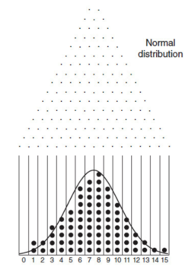

- if we restrict the horizontal movement of the ball, so that the ball needs to drop through 2 pins, then we end up with a narrower distribution:  
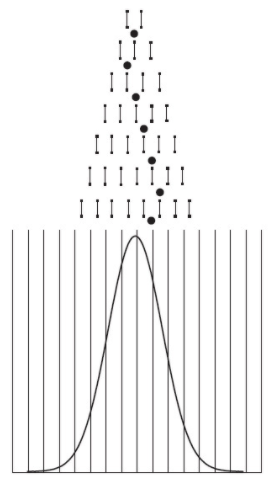

- if we extend the horizontal movement of the ball, so that the ball can move 2 pins left or right before it drops, then we end up with a fatter distribution:  
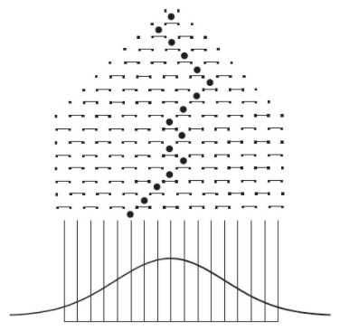

- if we consider the left/right movement of the ball as price movement, and down is passage of time, then we have:  
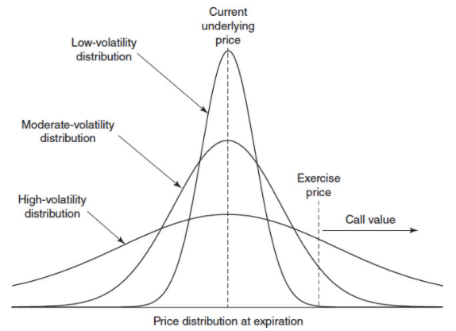

- if we know the distribution is normal, and we know the _mean_ and also the _standard deviation_, then we know all characteristics of the distribution


_mean_ - center of the distribution  
_standard deviation_ - how fast (wide) the distribution is; small sd = low vol; large sd = high vol


1\sigma - takes in approx. 68.3% (2/3) of all occurrences
2\sigma - takes in approx. 95.4% (19/20) of all occurrences
3\sigma - takes in approx. 99.7% (369/370) of all occurrences  

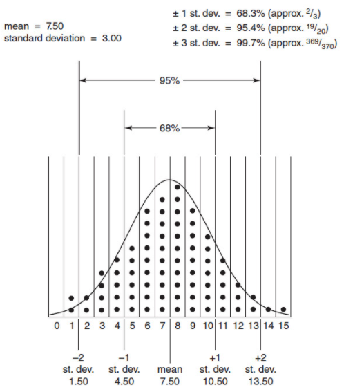

> **Example: wager**  
> given \sigma = \pm3, and that the mean is 7.5,  
> someone is willing to pay 30:1 odds against dropping ball into slot 14 or 15. Is the bet worth making?  
> i.e. the person is saying there is only a 1 in 30 chance the ball will drop in either 14 or 15...  
> 14, 15 lies beyond 2 sigma (sd), so chance is 1 in 20 (since 2 SDs takes in approx 19/20 of all occurrences)...  
> so initially, the 1 in 30 chance seems pretty good (in our favour), since we know the chance is better than that (1 in 20),  
> however, remember that normal distributions are symmetric, so the 1 in 20 chance also applies to the ball landing in 0 or 1, therefore 1 in 20 chance needs to be halved, which gives us 1 in 40 chance that the ball lands in 14 or 15, and not 0 or 1  
> 1 in 40 chance is much lower than 1 in 30, therefore its a bad bet to take the 1 in 30 wager...  
> i.e. the person should be paying 40:1 odds not 30:1 (e.g. pay $40 if ball drops in 14 or 15, while we pay $1 if ball doesn't drop in 14 or 15)

Our pricing model (which assumes a normal distribution) requires 2 inputs:

1. mean (_forward price_)
2. standard deviation (_volatility_), aka sigma (σ)


### Forward Price as Mean of Distribution
- pricing model requires a mean to establish a normal distribution, we use the underlying's forward price as the mean
- Forward Price i.e. Future Value ([PV(1 + r)^n](/study/cfa1/#the-_future-values_-of-a-single-cash-flow)  by applying interest etc)
- so model takes in the current price (PV), time to expiration, interest rates, dividends etc to calculate forward price (FV)

### Volatility as a Standard Deviation
- we feed volatility as standard deviation into pricing model
- working definition (for now): _volatility_ = one standard deviation, and is the percentage of price movement over one-year period
> **Example**:  
> forward price $100, with volatility of 20%;  
> in one year's time, there is a 68% chance of the price being within $80 to $120;  
> a 95% chance it is between $60 and $140 (2 σ);  
> and 99% chance its within $40 and $160 (3 σ)
- volatility is expressed as an annual percentage, therefore, to express volatility as a period of time other than annually we need to multiply annual vol by the square root of time:


\text{Volatilty}_t = \text{volatililty}_{annual} \times \sqrt{t}


> **Example: daily volatility**  
> annual volatility = 20%; therefore daily volatility = 0.2 \times \sqrt{\frac{1}{256}}  
> where we use 256 days in one year due to exchange holidays, and sqrt of 256 is a whole number...  

\text{Volatility}_{daily} = \text{volatility}_{annual} \times \sqrt{\frac{1}{256}} = \text{volatility}_{annual} \times \frac{1}{16} = \frac{\text{volatility}_{annual}}{16}

> **Example: weekly volatility**
> annual volatility = 20%; therefore weekly volatility = 0.2 \times \sqrt{\frac{1}{52}}  
> where we use 52 weeks because there is no single week where the entire week is a holiday...

\text{Volatility}_{weekly} = \text{volatility}_{annual} \times \sqrt{\frac{1}{52}} = \text{volatility}_{annual} \times \frac{1}{7.2} = \frac{\text{volatility}_{annual}}{7.2}

### Volatility vs Observed Price Changes
- must select a reasonably accurate volatility as input to the pricing model
- usually use settlement-to-settlement prices for the underlying equity to calculate volatility
- historical volatility may be a good starting point, but need to take into account recent behaviour/changes
- more realistic inputs = better outputs
> because there is a 1 in 20 chance a 2σ price movement occurs, and there are 20 trading days per month, traders expect a 2σ price movement to occurr once a month

### Lognormal Distributions
- Black-Scholes assumes a continuosly compounded volatility (instead of just compounded at the end of the year)
- when [continuous compounding (c/c)](/study/cfa1/#the-_future-values_-of-a-single-cash-flow) is applied, it creates a _lognormal distribution_:  

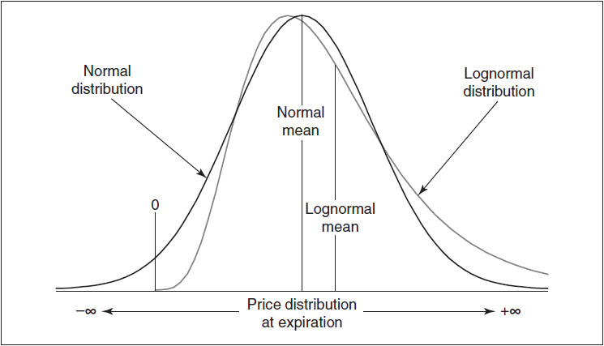

- notice:  
  - the price for lognormal distribution is capped at 0 to the downside (c/c precludes negative value), and uncapped to the upside
  - distribution is skewed to the right
  - mean is also not in the center but to the right of mode (highest point)

> **Example:**  
> A stock with forward price of $1,000 and a ±12% volatility (with continuous compounding), has a 68% (one standard deviation) chance of priced between:  
> \text{\$1,000} \times e^{0.12} = \text{\$1,127.50} and \text{\$1,000} \times e^{-0.12} = \text{\$886.92}  
>  
> so essentially we're compounding using the exponential function e^x; e is the growth factor for continuously compounding at 100% per interval, while x is the interest, which caps the growth to 12% only (instead of 100%); here the formula is simplified to ignore multiple intervals (N = 1)

> read up on exponential function (e^x) and its inverse ln(x)

### Interpreting Volatility Data
- categorize volatility into: _realized volatility_ vs _implied volatility_

#### Realized Volatility
- to calculate realized volatility, we must specify:
  - _interval size_ at which we're measuring the price changes (e.g. daily, weekly, monthly)
  - _number of intervals_ (e.g 200 day, 52 week etc)
- we need to estimate future realized volatility using historical realized volatility as a basis
- volatility forecasting models exist (explained in later chapters) to help predicting future volatility

> **Example:**  
> 50-day volatility: interval size = daily; # of intervals = 50  
> 52-week volatility: interval size = weekly; # of intervals = 52  

#### Implied Volatility
- reflects what the market is pricing the volatility as
- IV = working backwards (all other variables e.g. interest, time to expiration, underlying are fixed)
- the future realized volatility determines the option's _value_, while the implied volatility determines the option's _price_.
- option traders are concerned with option's value vs its price - i.e. selling when over-valued (priced higher than theoretical value), or buying when its under-valued (priced lower than theoretical value)
- every input into the pricing model is known except for the volatility; therefore the implied volatility makes the option "expensive" or "cheap"
- premium is synonymous with IV (because IV is the only subjective input) - expensive premium aka high IV; cheap premium aka low IV;
- traders often quote the IV instead of the price - e.g. I bought 100 call at 27.51%, or I sold 105 call at 29%


- 1. in point terms, change in volatility has greater effect on at-the-money option than on equivalent in-the-money or out-of-the-money option
- 2. in % terms, change in volatility has greater effect on out-of-money option than equivalent in-the-money or at-the-money option
- 3. change in volatility has greater effect on long-term option (in terms of points) than equivalent short-term option

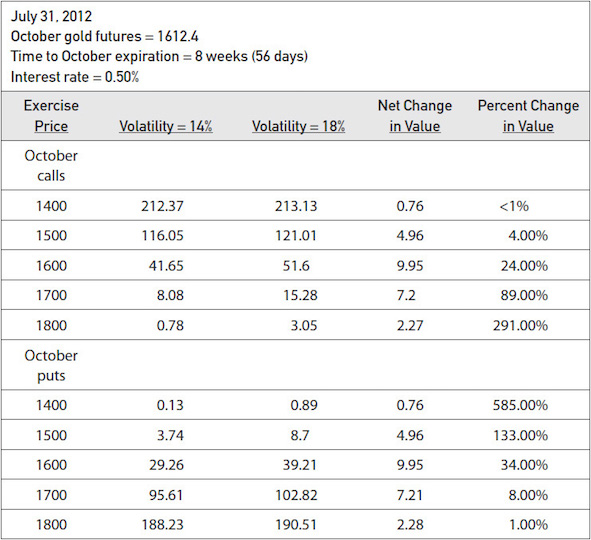  



## 7. Risk Measurement I

- delta, gamma, vega, theta and rho provides _sensitivity_ measures of the option to changes in the underlying's price and its acceleration, volatility, time to expiry and interest rate

- changes related to _price of underlying_, _volatility_, _time to expiration_:

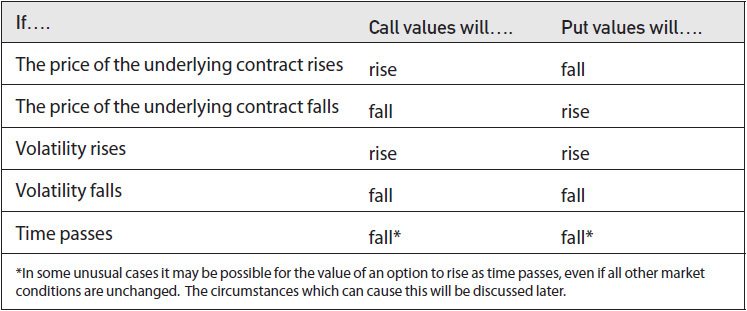

- changes related to _interest rate_:

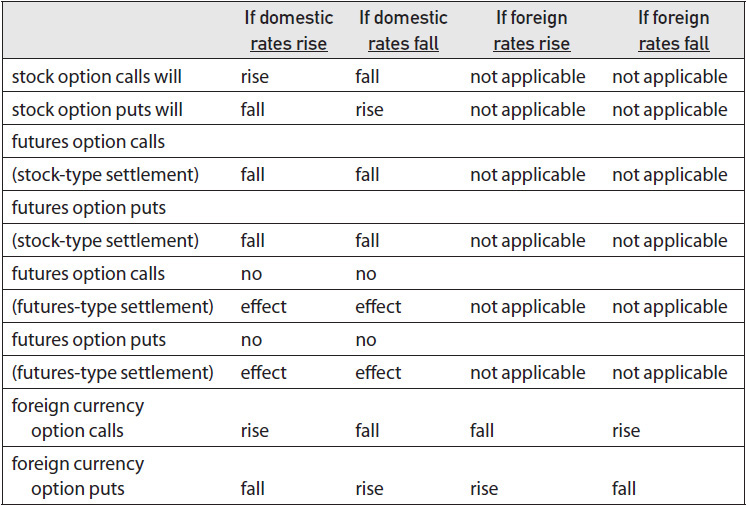

- changes related to _dividends_:

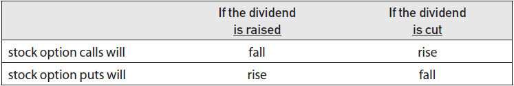


_Whenever possible a trader should avoid a short stock position_


- most option traders carry some long stock (holding the underlying) as part of their options position, so that when they need to be short stock to hedge against their option position, they could sell the stock they hold, instead of entering a short position

### 7.1. The Delta (Δ)

- delta is a measure of an option's risk with respect to the direction of movement of the underlying
- positive (+) delta indicates a desire for upward movement; negative (-) delta indicates desire for downard movement:

if price of the underlying _increases_: add delta to option value  
if price of the underlying _decreases_: subtract delta from option value


- there are several interpretations (meanings) of the delta: _rate of change_, _hedge ratio_, _position equivalence to underlying_, _probability_

#### Rate of Change

- this interpretation gives us sense of how fast (velocity) the option value is changing in terms of the underlying's value (at an instantanious price point of the underlying)
- the velocity is given by $d per one point change in the price of the underlying, where d is between 0.0 and (+/-) 1.0
- so e.g. for a call option, the output (y-axis) of our theoretical pricing model plots a graph like so:

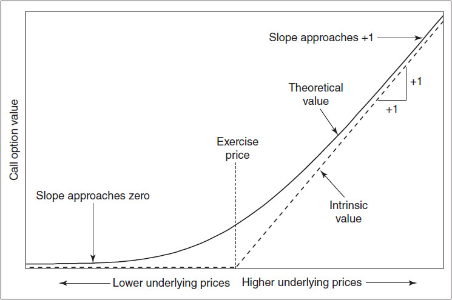

- x is the value of the underlying
- y is the theoretical value of the call option
- note our theoretical model is basically a function f(x) that takes the price of the underlying x with a bunch of other inputs and outputs the theoretical value of the option, with delta being the [(mathematical) derivative](https://www.khanacademy.org/math/ap-calculus-ab/ab-differentiation-1-new/ab-2-1/v/derivative-as-a-concept) of the theoretical price; aka slope, gradient, rate of change:

\Delta = \frac{\delta V}{\delta S}, where V = (theoretical) value of option, S = value of the underlying  

ie. delta is the instantaneous gradient (rate of change) of the value of the option at a particular underlying price


- recap: option premium (value) is made up of _intrinsic value_ and _extrinsic value_; intrinsic value when underlying is below strike price = $0; at expiration, option is worth exactly its intrinsic value (how much above / below the exercise price); and its extrinsic value would be $0
- from the graph above, the rate of change (Δy) of the call option's theoretical value with respect to a one point change of the underlying (Δx) is:
  - much smaller when the underlying is less than the exercise price
  - and gradually gets to 1 as the underlying moves above strike price

- for a put option, the graph is reversed:

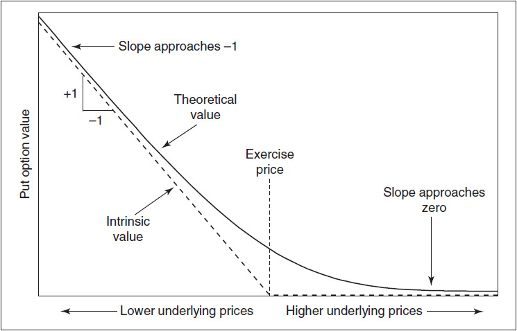

- notice the slope (delta) is negative - i.e. price of option increases when price of underlying decreases
> **Example:**  
> put option has a -20 delta; current price of the put option is $2.00;  
> when price of underlying _increases_ by $1.00, option value = $2.00 + (-0.2) = 1.80  
> when price of underlying _decreases_ by $1.00, option value = $2.00 - (-0.2) = 2.20  

> **Example:**  
> call option has 30 delta; if the price of the underlying gained $0.50, what is the expected change in option's value?
> delta of 30 (0.3) means the option value changes by 30% of the underlying's price change  
> so 0.3 x 0.5 = 0.15 - the option value is expected to gain $0.15  

> **Example (Delta of underlying):**  
> delta of the underlying, which is basically a linear function y = x, so the slope is always 1  
> therefore, _delta of underlying is always 100_  
> note its common to express delta as whole numbers from 0 to 100, e.g. a delta of 0.2 is said to be "20 delta"  

#### Hedge Ratio

- in this interpretation, we treat delta as a ratio to help us hedge using the underlying
- we know delta = rate of change of the option's theoretical value _with respect to_ a unit change of the price of the underlying
- so e.g. if delta was 0.3, then for every _x_ change in the price of the underlying, we can expect the option's theoretical value to change by 30% of _x_


A position is _neutrally hedged_ or _delta neutral_, if the total of all the deltas that make up the position adds up to 0


> **Example:**  
> if we were long 2x calls with 50 delta, and sell 1x contract size of the underlying, the total delta position is:  


\begin{aligned}
+2 \times 50&\\
-1 \times 100&\\
\hline
0&
\end{aligned}


> and if we sell 4x 75 delta puts, and sell 3x contract size underlying our delta position is:


\begin{aligned}
-4 \times -75&\\
-3 \times 100&\\
\hline
0&
\end{aligned}


> which is delta neutral

#### Theoretical or Equivalent Underlying Position

- in this interpretation, the delta is a proxy for the directional risk of a equivalent number of underlying positions
- e.g. a +500 delta call option is a proxy for long 500 shares of the underlying
- note: the underlying is sensitive to the directionality _only_, while option is sensitive to others (e.g. time to expiry, volatility etc), so an option position isn't a one-to-one equivalence of the underlying

#### Probability
- delta can also be interpreted as the probability of the option finishing in the money
- e.g a 20 delta call option can be interpreted as having a 20% chance of finishing in the money; a -75 delta put option can be interpreted as having a 75% chance of finishing in the money
- note delta is only an approximation of the probability, not an exact science (other factors at play, e.g interest, dividends)
- also a trader must evaluate a strategy by looking at how often it wins, but also how much it wins (e.g. 9 times out of 10 the strategy wins $1, but 1 out of 10 it looses $20, then the strategy isn't very good)
- the Black-Scholes model generates a number that more precisely reflects the probability

#### Summary

- a trader who is +500 delta knows he is equivalent of being long 500 of the underlying stock (equivalent underlying position interpretation)
- if he is maintaining a delta neutral position, he would need to hedge by selling short 500 of the underlying stock (hedge ratio interpretation)
- however if he is bullish, he understands that his position will change approx 5x (500%) of the rate of change of the underlying's price - e.g. if the price of the underlying increased by $2, then the trader's value will be 5x that or $10; and likewise, if the price of the underlying fell by $1.25, the trader potentially loses $6.25

### 7.2. The Gamma (Γ)

- _Gamma_ is how much delta changes with respect to the price of underlying
- i.e. It is the second derivative of the rate of change in option price with respect to the price of the underlying; sometimes also referred to as the option's _curvature_
- gamma can be thought of as the "acceleration" of the price of the option (change in the velocity, i.e. delta)

gamma is positive when long options (put or call), and negative when short;  
if price of underlying increases, add gamma to delta  
if price of underlying decreases, subtract gamma from delta  


> **Example (long call):**  
> if option gamma = 5, delta = 30; when underlying increase (decrease) in price by 1 point, add (subtract) 5 to (from) delta to get new delta of 35 (25)  
> if option gamma = 2, delta = 20; when underlying increase (decrease) by 2 points, add (subtract) 4 to (from) delta to get new delta of 24 (16)

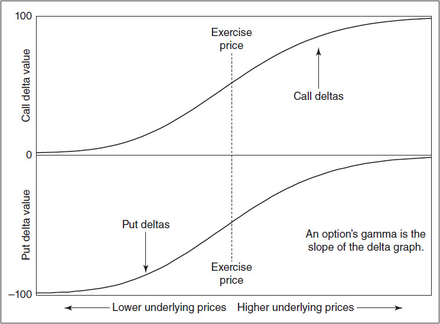

- so when underlying price increases, add gamma to delta; when underlying price decreases, subtract gamma from delta

> **Example (long put):**  
> if option gamma = 5, delta = -30; when underlying increase (decrease) in price by 1 point, add (subtract) 5 to (from) delta to get new delta of -25 (-35)  
> if option gamma = 2, delta = -20; when underlying increase (decrease) by 2 points, add (subtract) 4 to (from) delta to get new delta of -16 (-24)

- delta is only an _instananeous_ measure - i.e. delta is only valid for very small movement in price (of underlying); more sizable the movement of price, using constant delta becomes less accurate
- we can use gamma to get a better estimate of the new delta / price of the option:


\Delta = \text{current delta of option}\\
\Delta_{new} = \Delta + (S_1 - S_2) \times \Gamma\\
\Delta_{avg} = (\Delta + \Delta{new}) / 2 = (\Delta + \Delta + (S_1 - S_2) \times \Gamma) / 2 = \Delta + (S_1 - S_2) \times \Gamma / 2\\ 
C = \text{theoretical price of the option}\\
C_{new} = C + \Delta_{avg} \times (S_1 - S_2) = C + (\Delta + (S_1 - S_2) \times \Gamma / 2) \times (S_1 - S_2)\\



### 7.3. The Theta (Θ)

- at expiration, option is worth exactly its intrinsic value (time value decays to 0 at expiration)
- _theta (Θ)_ (_time decay_) is the rate at which option loses value as time passes, with all other conditions (e.g. price of underlying) unchanged
- expressed as _value lost per day_ - e.g. option with theta value of 0.05 will lose 0.05 for each day that passes with no changes to underlying's price
- see [Chapter 9](#9-risk-measurement-ii) for more on theta
- with changes to other conditions (e.g. underlying price), the theta changes

### 7.4. The Vega (K)

### 7.5. The Rho 

### Interpreting the Risk Measures

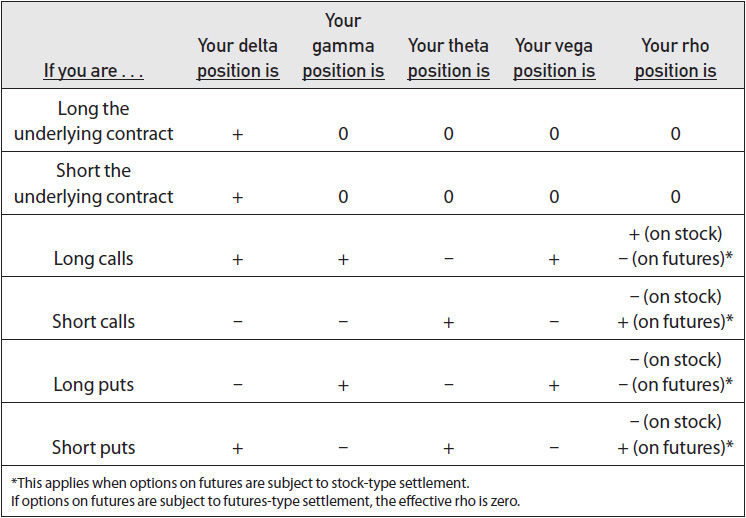

<iframe style="width: 100%; min-height: 500px" src="https://docs.google.com/spreadsheets/d/1oyvc7uHCVJINBvW-_PG2p8RyIQLnQp4KAg_2gnt7u2k/edit?usp=sharing&rm=minimal"></iframe> 

## 8. Dynamic Hedging

- _vanna_
- _charm_

## 9. Risk Measurement II
-

## Glossary

_Brownian motion_ - see p46, [Baxter & Rennie 1996 - Financial Calculus](/files/Financial_Calculus.PDF)
